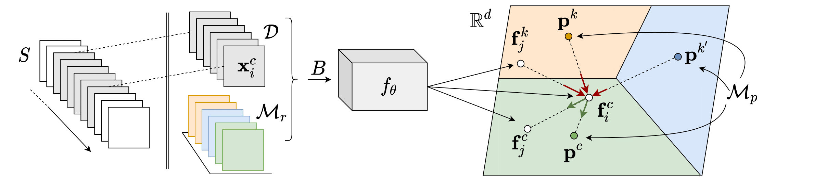

# Continual Prototype Evolution (CoPE)
Continual Prototype Evolution (CoPE) establishes online adaptation of class-representative prototypes in non-stationary data streams, exploiting latent space representations in the novel PPP-loss to enhance the state-of-the-art in continual learning.

This codebase contains the original PyTorch implementation of CoPE, along with the Split-MNIST, Split-CIFAR10, Split-CIFAR100 benchmarks.
The benchmarks have both a balanced and highly imbalanced variant, resembling more real-life settings.
Included baselines outperformed in these settings are: CoPE-CrossEntropy, GEM, iCaRL, GSS, reservoir sampling, finetuning, online iid, offline iid.

Paper available at: https://arxiv.org/pdf/2009.00919.pdf

**Keywords**: continual learning, prototypical learning, online learning, incremental learning, deep learning, representation learning, catastrophic forgetting, concept drift

## Results
Main scripts [main_MNIST.sh](main_MNIST.sh), [main_CIFAR10.sh](main_CIFAR10.sh), [main_CIFAR100.sh](main_CIFAR100.sh)
contain fully automatic pipeline (auto datapreparation), with hyperparameter configs for all of the experiments in the main paper.

The **balanced** setups contain: 
- Split-MNIST, Split-CIFAR10, Split-CIFAR100 and 
- lower capacity benchmarks Split-MNIST-mini and Split-CIFAR10-mini.

The **imbalanced** setups contain (averaged over 5 different choices of dominant task):
- Imbalanced Split-MNIST: 1 task 2k samples, others 0.2k (5 tasks)
- Imbalanced Split-CIFAR10: 1 task 4k samples, others 0.4k (5 tasks)
- Imbalanced Split-CIFAR100: 1 task 2k samples, others 1k (20 tasks)

## Requirements
- Python 3.7
- Pytorch 1.5 ([instructions](https://pytorch.org/get-started/previous-versions/#v150))
- To install dependencies:
    - Use [environment.yml](environment.yml) to create anaconda environment:
        
            conda env create -f environment.yml         # Env named 'cope'
            conda activate cope
    - Or manually, as in:
    
            # Create and activate environment
            conda create -n <name> python=3.7
            conda activate <name>

            # Pytorch (e.g. for CUDA 10.2)
            conda install pytorch==1.5.0 torchvision==0.6.0 cudatoolkit=10.2 -c pytorch

            # Optional
            conda install -c conda-forge matplotlib=3.1.3       # T-SNE plots
            conda install -c conda-forge scikit-learn=0.22.1
            conda install -c omnia quadprog                     # GEM baseline

## Online Data incremental learning
Although the data streams are divided into tasks to compare with task and class-incremental learning alorithms (iCaRL, GEM),
in CoPE the continual learner is unaware of tasks or task transitions.
This means CoPE can learn from any labeled data stream, without the bias of hand-designed task boundaries within the stream.

## Learner-evaluator framework
The learner-evaluator framework defined in the [paper](https://arxiv.org/pdf/2009.00919.pdf), explicitly models all the 
requirements of the continual learning system. 

We define the **learner** here for CoPE:
- The horizon = the currently observed batch (online processing)
- The operational memory = replay memory + prototypical memory

With the **evaluator**:
- Periodicity (rho) = evaluating on task transitions
- Eval distribution = static class distributions, evaluate on observed classes in learner

## Credits
- Consider citing our work upon using this repo.

        @article{de2020continual,
          title={Continual Prototype Evolution: Learning Online from Non-Stationary Data Streams},
          author={De Lange, Matthias and Tuytelaars, Tinne},
          journal={arXiv preprint arXiv:2009.00919},
          year={2020}
        }
- CoPE has been made available in the [Avalanche framework](https://github.com/ContinualAI/avalanche/) (free to use under MIT license)!
- Thanks to the following repositories:
    - https://github.com/facebookresearch/GradientEpisodicMemory
    - https://github.com/rahafaljundi/Gradient-based-Sample-Selection
    - https://github.com/Mattdl/CLsurvey

This source code is released under a Attribution-NonCommercial 4.0 International license, find out more about it in the [LICENSE file](LICENSE).
